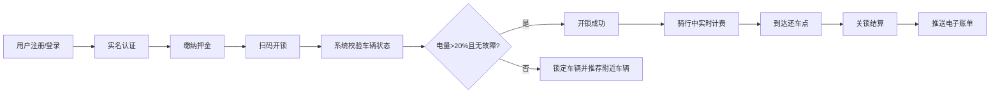
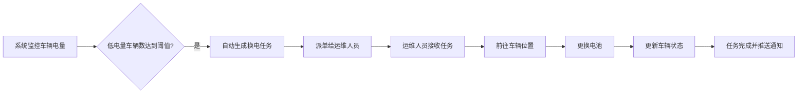
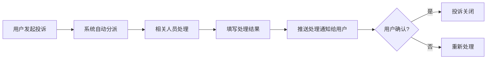

## 1. 产品概述

共享电动助力车出行平台是一个面向多城市的智慧出行解决方案，通过物联网技术和智能调度算法，为用户提供便捷、绿色的短途出行服务，同时为运营团队提供高效的车辆管理和运维工具。

- **核心价值**：解决城市短途出行痛点，提升车辆运营效率，降低运维成本
- **目标用户**：普通市民、运维人员、调度员、财务人员、平台管理员
- **市场定位**：智慧城市出行基础设施提供商

## 2. 核心功能

### 2.1 用户角色

| 角色 | 登录方式 | 核心权限 |
|------|----------|----------|
| 用户 | 手机号+验证码 | 注册认证、扫码骑行、费用支付、投诉建议 |
| 运维人员 | 账号密码 | 车辆状态查看、换电任务执行、故障维修登记 |
| 调度员 | 账号密码 | 热力图查看、调度建议确认、调度任务管理 |
| 财务 | 账号密码 | 收入统计、押金管理、成本核算、利润报表 |
| 管理员 | 账号密码 | 系统参数配置、多城市数据对比、全局管理 |

### 2.2 功能模块

1. **用户端**：首页地图、扫码开锁、骑行中、订单结算、个人中心、投诉中心
2. **运维端**：任务看板、车辆列表、换电任务、维修记录
3. **调度端**：热力地图、调度建议、调度任务、区域管理
4. **财务端**：收入概览、押金管理、成本统计、利润报表
5. **管理端**：计费规则、信用分配置、调度参数、数据看板、用户管理

### 2.3 页面详情

| 页面名称 | 模块名称 | 功能描述 |
|----------|----------|----------|
| 用户首页 | 地图展示 | 显示附近车辆、当前位置、扫码按钮 |
| 用户首页 | 车辆列表 | 展示附近可用车辆、电量、距离 |
| 骑行中 | 实时数据 | 骑行时长、里程、预估费用、电量显示 |
| 骑行中 | 地图导航 | 实时位置追踪、还车点提示 |
| 订单结算 | 费用明细 | 时长费、里程费、优惠抵扣、实付金额 |
| 个人中心 | 实名认证 | 身份证上传、人脸识别、认证状态 |
| 个人中心 | 押金管理 | 押金缴纳、押金退还、信用分展示 |
| 投诉中心 | 投诉列表 | 我的投诉、处理进度、确认关闭 |
| 投诉中心 | 投诉提交 | 投诉类型选择、图片上传、问题描述 |
| 运维看板 | 任务概览 | 今日换电任务、待处理故障、完成统计 |
| 运维看板 | 车辆列表 | 负责区域车辆、状态筛选、详情查看 |
| 换电任务 | 任务列表 | 待执行、进行中、已完成换电任务 |
| 换电任务 | 任务详情 | 车辆位置、电量信息、操作记录 |
| 维修管理 | 故障报修 | 故障类型、维修记录、状态更新 |
| 调度热力图 | 区域热力 | 车辆密度热力图、人流热力图 |
| 调度建议 | AI建议 | 系统生成的调度建议、确认执行 |
| 调度任务 | 任务管理 | 调度任务列表、进度追踪 |
| 财务概览 | 数据看板 | 今日收入、订单数、押金变动 |
| 财务报表 | 利润报表 | 月度利润、收入成本明细、自动生成 |
| 管理配置 | 计费规则 | 起步价、时长费、里程费配置 |
| 管理配置 | 信用分 | 信用分规则、押金梯度配置 |
| 数据看板 | 城市对比 | 多城市周转率、故障率、满意度雷达图 |

## 3. 核心流程

### 3.1 用户骑行流程

### 3.2 运维换电流程

### 3.3 投诉处理流程

## 4. 用户界面设计

### 4.1 设计风格

- **主色调**：科技蓝 (#0EA5E9)，代表智慧、环保、可靠
- **辅助色**：活力橙 (#F97316) 用于操作按钮和强调信息
- **成功色**：翠绿 (#10B981) 表示正常、完成
- **警告色**：琥珀黄 (#F59E0B) 表示低电量、注意
- **危险色**：玫红 (#EF4444) 表示故障、错误
- **字体**：使用 Inter 作为主要字体，搭配现代无衬线风格
- **按钮风格**：圆角胶囊形按钮，带有微阴影和悬停动效
- **布局风格**：卡片式布局，清晰的信息层级，充足的留白
- **图标风格**：使用 Lucide 线性图标，简洁现代

### 4.2 页面设计概述

| 页面名称 | 模块名称 | UI 元素 |
|----------|----------|---------|
| 用户首页 | 地图区域 | 全屏地图、车辆标记、定位按钮、渐变遮罩 |
| 用户首页 | 底部操作区 | 扫码按钮（悬浮圆形）、附近车辆列表卡片 |
| 骑行中 | 顶部信息栏 | 半透明毛玻璃效果、实时数据大字展示 |
| 骑行中 | 地图区域 | 行驶轨迹线、终点标记、电量预警动画 |
| 订单结算 | 费用卡片 | 渐变顶部、费用明细列表、支付按钮 |
| 运维看板 | 数据卡片 | 四色统计卡片、图标+数字+趋势 |
| 热力图页 | 地图区域 | 热力图层叠加、区域划分、图例说明 |
| 财务报表 | 图表区域 | 柱状图+折线图组合、数据表格 |
| 管理配置 | 表单区域 | 分组配置项、滑块控件、实时预览 |

### 4.3 响应式设计

- **设计策略**：桌面端优先，移动端适配
- **断点设置**：移动端 < 768px，平板端 768-1024px，桌面端 > 1024px
- **移动端优化**：底部导航栏、全屏地图、触摸友好的按钮尺寸
- **桌面端优化**：侧边栏导航、多面板布局、数据密集型展示

### 4.4 动效设计

- **页面切换**：淡入淡出 + 轻微位移
- **按钮交互**：悬停放大、点击缩放、涟漪效果
- **数据加载**：骨架屏脉冲动画
- **地图标记**：呼吸动画、弹跳出现效果
- **通知推送**：顶部滑入、轻微弹跳
- **骑行中**：电量预警闪烁、轨迹线渐显
