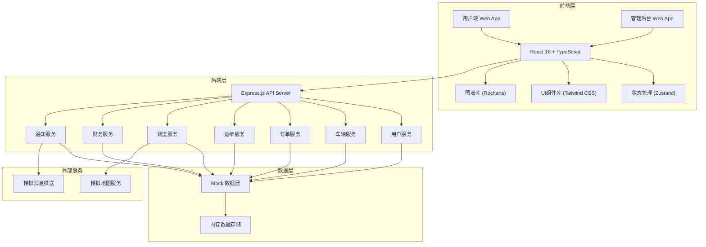
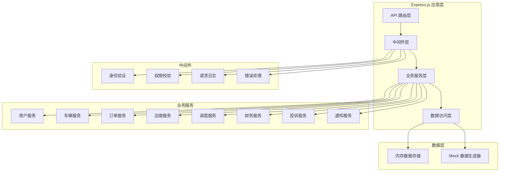
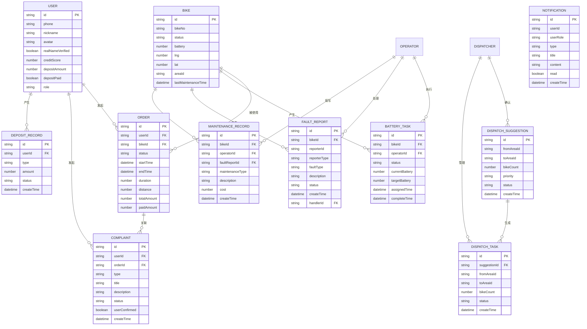

## 1. 架构设计



## 2. 技术说明

### 2.1 技术栈选型

- **前端框架**：React 18 + TypeScript
  - 采用函数式组件 + Hooks 开发模式
  - TypeScript 提供完整的类型安全保障
- **构建工具**：Vite
  - 极速热更新，开发体验优秀
  - 原生支持 ES Modules
- **样式方案**：Tailwind CSS 3
  - 原子化 CSS，快速构建 UI
  - 响应式设计内置支持
- **状态管理**：Zustand
  - 轻量级状态管理，API 简洁
  - 支持 DevTools 和中间件
- **路由管理**：React Router DOM 6
  - 声明式路由，支持嵌套路由
- **图表库**：Recharts
  - React 原生图表组件
  - 支持柱状图、折线图、雷达图等
- **图标库**：Lucide React
  - 轻量级 SVG 图标
  - 统一的线性风格
- **后端框架**：Express.js 4
  - 轻量级 Node.js Web 框架
  - 中间件生态丰富
- **数据存储**：内存 Mock 数据
  - 前端演示用 Mock 数据
  - 模拟真实业务场景

### 2.2 项目初始化

使用 `vite-init` 脚手架初始化项目，选择 `react-express-ts` 模板，包含：
- React 前端 + Express 后端
- TypeScript 全栈支持
- Tailwind CSS 内置配置
- 前后端统一的类型定义

## 3. 路由定义

### 3.1 前端路由

| 路由路径 | 页面名称 | 所属角色 | 说明 |
|----------|----------|----------|------|
| /login | 登录页 | 所有角色 | 角色选择 + 登录表单 |
| /user | 用户首页 | 用户 | 地图 + 附近车辆 + 扫码 |
| /user/riding | 骑行中 | 用户 | 实时骑行数据 + 地图 |
| /user/order/:id | 订单详情 | 用户 | 费用明细 + 电子账单 |
| /user/profile | 个人中心 | 用户 | 个人信息 + 实名认证 + 押金 |
| /user/complaints | 投诉中心 | 用户 | 投诉列表 + 提交投诉 |
| /operator | 运维看板 | 运维 | 任务概览 + 车辆列表 |
| /operator/battery | 换电任务 | 运维 | 换电任务列表 + 详情 |
| /operator/maintenance | 维修管理 | 运维 | 故障报修 + 维修记录 |
| /dispatcher | 调度首页 | 调度员 | 热力图 + 调度建议 |
| /dispatcher/tasks | 调度任务 | 调度员 | 调度任务管理 |
| /finance | 财务概览 | 财务 | 收入看板 + 统计图表 |
| /finance/deposit | 押金管理 | 财务 | 押金收退记录 |
| /finance/reports | 利润报表 | 财务 | 月度利润报表 |
| /admin | 管理首页 | 管理员 | 数据看板 + 城市对比 |
| /admin/pricing | 计费规则 | 管理员 | 计费参数配置 |
| /admin/credit | 信用分配置 | 管理员 | 信用分规则 + 押金梯度 |
| /admin/dispatch | 调度参数 | 管理员 | 调度算法参数配置 |
| /admin/users | 用户管理 | 管理员 | 用户列表 + 角色管理 |

## 4. API 定义

### 4.1 用户相关

```typescript
// 用户登录
interface LoginRequest { phone: string; code: string; }
interface LoginResponse { token: string; user: User; }

// 用户信息
interface User {
  id: string;
  phone: string;
  nickname: string;
  avatar: string;
  realNameVerified: boolean;
  creditScore: number;
  depositAmount: number;
  depositPaid: boolean;
}

// 实名认证
interface VerifyRealNameRequest {
  idCard: string;
  realName: string;
  idCardFront: string;
  idCardBack: string;
}
```

### 4.2 车辆相关

```typescript
// 车辆信息
interface Bike {
  id: string;
  bikeNo: string;
  status: 'available' | 'in-use' | 'low-battery' | 'fault' | 'maintenance';
  battery: number;
  lng: number;
  lat: number;
  distance?: number;
  lastMaintenanceTime?: string;
}

// 附近车辆查询
interface NearbyBikesRequest { lng: number; lat: number; radius?: number; }
interface NearbyBikesResponse { bikes: Bike[]; }

// 扫码开锁
interface UnlockRequest { bikeId: string; userId: string; }
interface UnlockResponse {
  success: boolean;
  orderId?: string;
  message?: string;
  recommendedBikes?: Bike[];
}
```

### 4.3 订单相关

```typescript
// 订单信息
interface Order {
  id: string;
  userId: string;
  bikeId: string;
  bikeNo: string;
  status: 'ongoing' | 'completed' | 'cancelled';
  startTime: string;
  endTime?: string;
  duration: number; // 秒
  distance: number; // 米
  startLng: number;
  startLat: number;
  endLng?: number;
  endLat?: number;
  baseFee: number;
  durationFee: number;
  distanceFee: number;
  discount: number;
  totalAmount: number;
  paidAmount: number;
}

// 骑行中实时数据
interface RidingData {
  orderId: string;
  duration: number;
  distance: number;
  estimatedCost: number;
  currentBattery: number;
  currentLng: number;
  currentLat: number;
}

// 还车结算
interface ReturnBikeRequest { orderId: string; lng: number; lat: number; }
interface ReturnBikeResponse { order: Order; }
```

### 4.4 运维相关

```typescript
// 换电任务
interface BatteryTask {
  id: string;
  bikeId: string;
  bikeNo: string;
  operatorId?: string;
  status: 'pending' | 'assigned' | 'in-progress' | 'completed';
  currentBattery: number;
  targetBattery?: number;
  lng: number;
  lat: number;
  assignedTime?: string;
  startTime?: string;
  completeTime?: string;
}

// 故障报修
interface FaultReport {
  id: string;
  bikeId: string;
  bikeNo: string;
  reporterId: string;
  reporterType: 'user' | 'operator' | 'system';
  faultType: string;
  description: string;
  images: string[];
  status: 'pending' | 'processing' | 'resolved' | 'closed';
  createTime: string;
  handlerId?: string;
  handleTime?: string;
  handleResult?: string;
}

// 维修记录
interface MaintenanceRecord {
  id: string;
  bikeId: string;
  faultReportId?: string;
  operatorId: string;
  maintenanceType: string;
  description: string;
  partsReplaced: string[];
  cost: number;
  createTime: string;
}
```

### 4.5 调度相关

```typescript
// 区域热力数据
interface HeatmapData {
  areaId: string;
  areaName: string;
  bikeCount: number;
  demandLevel: 'low' | 'medium' | 'high' | 'very-high';
  centerLng: number;
  centerLat: number;
}

// 调度建议
interface DispatchSuggestion {
  id: string;
  fromAreaId: string;
  fromAreaName: string;
  toAreaId: string;
  toAreaName: string;
  bikeCount: number;
  reason: string;
  priority: 'high' | 'medium' | 'low';
  createTime: string;
  status: 'pending' | 'confirmed' | 'rejected' | 'completed';
}

// 调度任务
interface DispatchTask {
  id: string;
  suggestionId?: string;
  fromAreaId: string;
  fromAreaName: string;
  toAreaId: string;
  toAreaName: string;
  bikeCount: number;
  status: 'pending' | 'in-progress' | 'completed';
  assignedStaff: string[];
  createTime: string;
  completeTime?: string;
}
```

### 4.6 财务相关

```typescript
// 财务概览
interface FinanceOverview {
  todayRevenue: number;
  todayOrders: number;
  todayDepositIn: number;
  todayDepositOut: number;
  monthRevenue: number;
  monthOrders: number;
}

// 日收入统计
interface DailyRevenue {
  date: string;
  revenue: number;
  orders: number;
  avgOrderAmount: number;
}

// 押金记录
interface DepositRecord {
  id: string;
  userId: string;
  userName: string;
  type: 'deposit' | 'refund';
  amount: number;
  status: 'pending' | 'completed' | 'failed';
  createTime: string;
  completeTime?: string;
}

// 运营成本
interface OperatingCost {
  date: string;
  batteryCost: number;
  maintenanceCost: number;
  staffCost: number;
  otherCost: number;
  totalCost: number;
}

// 利润报表
interface ProfitReport {
  month: string;
  totalRevenue: number;
  orderRevenue: number;
  depositIncome: number;
  totalCost: number;
  batteryCost: number;
  maintenanceCost: number;
  staffCost: number;
  otherCost: number;
  netProfit: number;
  profitMargin: number;
}
```

### 4.7 投诉相关

```typescript
// 投诉记录
interface Complaint {
  id: string;
  userId: string;
  userName: string;
  orderId?: string;
  type: 'bike-fault' | 'billing-dispute' | 'other';
  title: string;
  description: string;
  images: string[];
  status: 'pending' | 'processing' | 'resolved' | 'closed';
  handlerId?: string;
  handlerName?: string;
  handleResult?: string;
  userConfirmed: boolean;
  createTime: string;
  handleTime?: string;
  closeTime?: string;
}
```

### 4.8 消息通知

```typescript
// 通知消息
interface Notification {
  id: string;
  userId: string;
  userRole: 'user' | 'operator' | 'dispatcher' | 'finance' | 'admin';
  type: 'unlock' | 'order-complete' | 'battery-task' | 'fault' | 'dispatch' | 'complaint' | 'system';
  title: string;
  content: string;
  relatedId?: string;
  relatedType?: string;
  read: boolean;
  createTime: string;
}
```

## 5. 服务器架构图



## 6. 数据模型

### 6.1 数据模型定义



### 6.2 系统配置数据

```typescript
// 计费规则配置
interface PricingConfig {
  baseFee: number;          // 起步价
  baseDuration: number;     // 起步时长(分钟)
  durationFee: number;      // 时长费(元/分钟)
  distanceFee: number;      // 里程费(元/公里)
  maxDailyFee: number;      // 每日封顶
  freeDuration: number;     // 免费时长(分钟)
}

// 信用分配置
interface CreditConfig {
  initialScore: number;     // 初始信用分
  minScore: number;         // 最低信用分
  maxScore: number;         // 最高信用分
  
  // 加分规则
  completeRideBonus: number;     // 完成骑行加分
  reportFaultBonus: number;      // 举报故障加分
  
  // 扣分规则
  overtimeParkingPenalty: number;   // 违停扣分
  damagePenalty: number;            // 损坏车辆扣分
  complaintPenalty: number;         // 被投诉扣分
  
  // 押金梯度
  depositTiers: {
    minScore: number;
    maxScore: number;
    depositAmount: number;
  }[];
}

// 调度参数配置
interface DispatchConfig {
  lowBatteryThreshold: number;     // 低电量阈值(%)
  batteryTaskBatchSize: number;    // 换电任务批量生成数量
  demandPredictionDays: number;    // 需求预测天数
  heatmapUpdateInterval: number;   // 热力图更新间隔(秒)
  highDensityThreshold: number;    // 高密度阈值(车辆数)
  lowDensityThreshold: number;     // 低密度阈值(车辆数)
}

// 系统配置
interface SystemConfig {
  pricing: PricingConfig;
  credit: CreditConfig;
  dispatch: DispatchConfig;
}
```

### 6.3 城市对比数据

```typescript
// 城市运营数据
interface CityStats {
  cityId: string;
  cityName: string;
  totalBikes: number;
  turnoverRate: number;      // 周转率
  faultRate: number;         // 故障率
  satisfactionRate: number;  // 满意度
  avgDailyOrders: number;    // 日均订单数
  avgRevenuePerBike: number; // 车均收入
}
```
